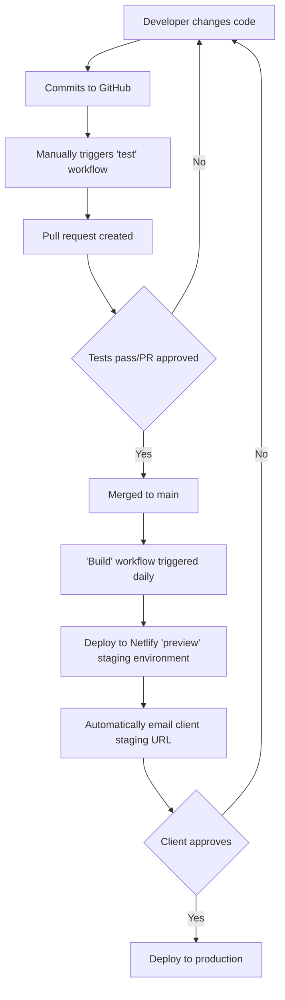
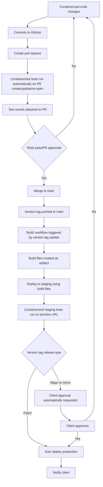
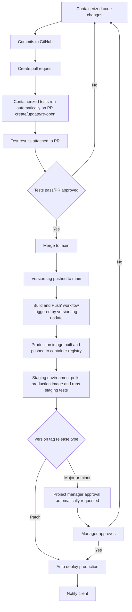
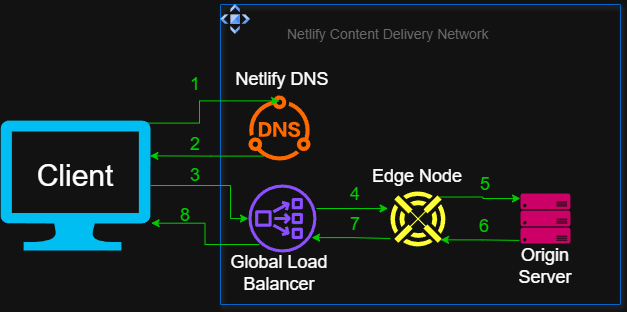
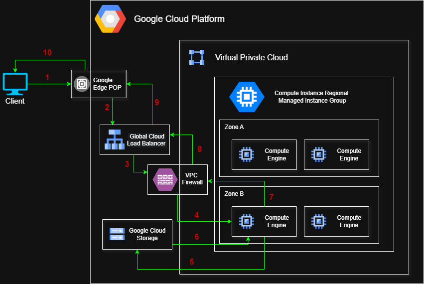
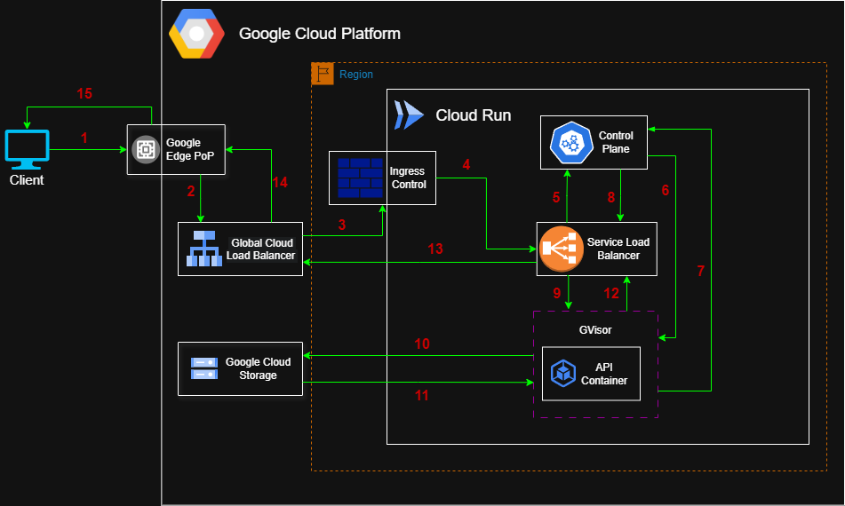

# Case Study & Proposal

The following is a report on the case study for the Super Cool Computing Company (SCC). This report seeks to explore the following:

- An explanation of core development operations (DevOps) concepts
- The current (DevOps) technologies and concepts employed by this company
- How they effect the business
- Proposed changes to current DevOps technologies and concepts and the potential benefits
- Application architecture diagrams (AAD's) outlining proposed changes

---

## Explaining Core Concepts

An understanding of the following concepts is key to understanding the current DevOps practices, and suggesting appropriate improvements. As such, we will explore 'Cloud Computing' and 'Containerization', understanding their key attributes, their advantages and disadvantages.

---

## Cloud Computing

Cloud computing is most often described as the provisioning of compute resources over the internet. Using an internet connection, a client can remotely utilize a combination of physical resources like servers, storage devices, and application resources[^1] like database software or large language models (LLM's). If you search for cloud computing, you will find endless similar variations of the same answer. Unfortunately, its not entirely accurate.

Cloud computing is not the delivery of compute resources over the internet, but rather over _any_ dedicated network, the most commonly used of which is the internet[^2]. An example of this is Amazon Web Service's (AWS) Direct Connect Service[^3]. This service involves building a direct private physical network connection between a client location and a Direct Connect location, bypassing the internet entirely to provision AWS Cloud resources.

### Types of Cloud Deployment

There are different deployment types utilized in cloud computing, determining how cloud services are delivered to and utilized by the client. Security, cost, regulatory compliance, location and existing infrastructure are the most important factors in discerning which cloud deployment type is most appropriate for a client[^4].

1. **Public Cloud:** This Cloud deployment type refers to services provided over a dedicated public network. These services are most commonly provided by industry giants, such as Amazon Web Services (AWS), Microsoft Azure, or Google Cloud Platform (GCP)[^5].
   - _**Security:**_ Communication through a public network provides more potential attack vectors. However, large cloud providers often provide advanced security features and implementation services, such as AWS Shield with its advanced DDoS protection[^6]. This can largely mitigates the risk of using public networks.
   - _**Cost:**_ Per compute resource, public Cloud services are generally more costly, though this is mitigated through a 'pay as you go' pricing structure where the client only pays for utilized compute resources. This allows the client to much more accurately 'right size' public cloud resources, utilizing auto scaling and load balancing to ensure the client is only using resources they need, reducing over-provisioning. Accordingly, public cloud resources can be more cost effective for dynamic and difficult to predict workloads.
   - _**Regulatory Compliance:**_ Regulations are specific to geographic regions. Utilizing public cloud resources allows a client to choose a location with the most appropriate regulatory laws to deploy their resources. Conversely, public cloud resources may not always be available in a region that meets your regulatory needs.
   - _**Location:**_ For clients providing public facing resources (such as website applications), the location of their user base relative to the company physical location greatly effects the latency. For example, if the user base is predominately located in a different continent, or distributed globally, using the public cloud allows the deployment of resources closest to the user base, and global distribution. This is an extremely important consideration for latency sensitive applications such as gaming servers.
2. **Private Cloud:** A more nebulous concept, the definition of private cloud usually refers to strictly on-premises dedicated private compute resources, but may include dedicated and isolated hardware allocated by cloud providers over a private connection. As such, there are some grey areas, such as AWS EC2 Dedicate Hosts[^7]. This service provides a dedicated, private physical server for only the client, running EC2 instances. However, it is still a resource provided by a public Cloud provider, and accessed through a public network. So if this service was connected to using the private 'Direct Connect' option, would it then qualify as a public, private or hybrid cloud deployment? Such edge cases should be considered when discussing which deployment type is appropriate.
   - _**Security:**_ In theory a private connection to compute resources should make them more secure. In practice, clients utilizing Private Cloud are entirely responsible for securing their resources, and there are many examples of organizations failing to keep pace with industry security standards. Private cloud gives more security control - but it's dependent on the client whether this is a pro or a con.
   - _**Cost:**_ As previously mentioned, Public Cloud can offer cost benefits for dynamic and difficult to predict workloads. Conversely, for steady state, predictable workloads, Private Cloud use can be significantly cheaper.
   - _**Regulatory Compliance:**_ Many industries (e.g. banking, government) can require completely isolated and private resources to meet regulatory compliance, making Private Cloud usage their only available option[^8].
   - _**Location:**_ When using on premises Private Cloud, clients should note they are held to the region specific compliance laws that apply. Prevalence of natural disasters, especially earthquakes, can significantly effect the feasibility of on premises resources in the location.
3. **Hybrid Cloud:** As it sounds, Hybrid Cloud is the utilization of both Private and Public Cloud resources in tandem. This can be useful for optimizing costs, improving global coverage, upgrading existing resources etc.
   - _**Security:**_ Security implications can vary wildly depending on hybrid implementation. For example, AWS Outposts allow clients to utilize AWS services within on-premises infrastructure, combining the security benefits of Private Cloud with the security management tools offered by AWS[^9]. Conversely, security needs could be significantly complicated if a hybrid setup requires separate management of Private and Public Cloud resources.
   - _**Cost:**_ A hybrid setup is utilized by the majority of organizations/companies for good reason - combining the cost benefits of both can be a powerful money saving solution. For example, utilizing Private Cloud resources to handle a baseline steady state of resources while using the Public Cloud to handle auto-scaling during demand peaks.
   - _**Regulatory Compliance:**_ Hybrid Cloud setups can be used to meet on premises data storage requirements while still utilizing Public Cloud resources for other compute needs.
   - _**Location:**_ Utilizing Hybrid Cloud can reduce latency for users of a service when a user base starts to spread globally or in a different geographic region.

### Cloud Computing Services

Modern Cloud Computing utilizes a concept called Anything-as-a-Service (XaaS). This is the idea of providing any required type of compute service through cloud infrastructure, and can be broken down into three main types[^4]:

1. **Infrastructure as a Service (IaaS):** The idea of IaaS is to provide underlying compute infrastructure as a service to a client, most commonly as server hardware resources. The most commonly known examples of this are AWS's Elastic Compute Cloud (EC2), Azure Virtual Machine (VM) instances, and the Google Cloud Compute Engine (GCCE). In all three cases, the client provisions underlying physical hardware resources in which to run VM instances. In this service, the Cloud provider is responsible for the physical security and management of the physical hardware, underlying server OS and Hypervisor. The client is responsible for maintaining the guest (VM) OS, encrypting data in transit and at rest, and securing access to resources running within the VM. This can be seen in AWS's 'Shared Responsibility Model'[^10].
2. **Platform as a Service (PaaS):** This service takes things one step further, abstracting away management of virtual machines, scaling and load balancing. In this model, the client is responsible only for maintaining application code, encrypting data in transit and at rest (although some PaaS services encrypt data at rest by default), and managing secure access to the application. This service is most suited to containerized applications and microservices, but it is not a requirement. Famous examples include AWS Elastic Beanstalk, Azure App Service and Heroku. It should be noted that applications running on PaaS are not always running within abstracted VM's, as other runtime options exist (such as GVisor in GCP Cloud Run).
   - **a. Serverless (subset of PaaS):** The furthest in abstraction that PaaS can provide, 'Serverless' computing involves a total abstraction of server management, with the cloud provider automatically provisioning the required resources. Serverless computing can be event driven code (e.g. AWS Lambda, Google Cloud Function) which runs event based functions, scaling down to zero automatically between events and typically charged in the range of milliseconds[^11]. It can also be abstracted container orchestration services (e.g. AWS Fargate, Google Cloud Run), where the client is only responsible for the container management and the Cloud Provider abstracts cluster management.
3. **Software as a Service (Saas):** The highest level of abstraction, SaaS describes public facing remotely hosted applications, providing a service to users. This is the most commonly seen service, ranging from Google's Cloud Suite (Gmail, Docs etc.) to Zoom, Trello, Dropbox and many more. In this service model, the user is only responsible for securing sensitive access information, while the provider manages every other aspect

_**Allocation of responsibilities across Cloud Services:**_

| **Responsibility**                 | **IaaS** | **PaaS** | **PaaS - Serverless** | **Saas** |
| ---------------------------------- | -------- | -------- | --------------------- | -------- |
| **Physical Hardware**              | Provider | Provider | Provider              | Provider |
| **Hypervisor & Host OS**           | Provider | Provider | Provider              | Provider |
| **Guest OS/Runtime**               | Client   | Provider | Provider              | Provider |
| **Application Code**               | Client   | Client   | Client                | Provider |
| **Data Encryption**                | Client   | Shared   | Shared                | Provider |
| **Identity and Access Management** | Client   | Client   | Client                | Client   |
| **Scaling of Resources**           | Client   | Shared   | Shared                | Provider |

---

## Containerization

The purpose of containerization is to package applications into a 'single lightweight executable'[^12] that defines its own consistent runtime, allowing its hosted application or service to run consistently across whatever environment it is run within.

### Core Concepts of Containerization

1. **Shared Host Kernel:** One of the core differences between a container and a VM is the sharing of the underlying host kernel, the core component of an operating system[^13]. Because VM's require their own kernel, the host machine needs to partition compute resources for the running VM that cannot be shared between the host and the guest. In comparison, a container can share compute resources with the host, reducing the resource overhead required. This means containers are much quicker to start and stop, but this comes at the cost of security, as containers have a lower degree of isolation from the host machine[^14].
2. **Packaged Dependencies**: All of the dependencies required for a container to run are packaged within a container. This is a key concept in containerization as it ensures that the service executed within the container remains in a consistent environment, even across different hosts.
3. **Image Layers:** An image can be thought of as the blueprint for a container. It contains all the instructions required to build the container with the necessary files and configuration. Each container image is composed of layers, with each layer representing 'a set of file system changes that add, remove or modify files'[^15]. Each image starts from a base image, containing core runtime requirements, such as package managers and system level binaries. This mimics an OS environment while still technically running on the host OS. All previously mentioned packaged dependencies are defined as layers in the container image.
4. **Namespace Isolation:** Despite sharing the host kernel, containers achieve a high degree of isolation from other processes running on the same host through 'namespace isolation'. Namespaces are isolated spaces that give processes access to 8 types of system level resources, grouped into the following namespaces - Cgroup, IPC, Network, Mount, PID, User, UTS and Time[^16]. Each namespace type can have multiple instances, with the resources of each instance being completely isolated from the other instances. This isolation is achieved by 'virtualization', creating a filtered and remapped view of the physical hardware resources. This means processes running within a namespace are only able to effect the resources and processes sharing that namespace, achieving a high degree of isolation.
5. **Resource Usage:** Unlike VM's which have a specific amount of allocated compute resources, containers by default have no resource constraints (outside of host kernel limitations). This dynamic resource provisioning has the advantage of flexible and efficient resource usage - however, running containers can cause system instability and crashes if the host machine runs out of resources (e.g. by killing processes when too much memory is utilized)[^17]. This can be mitigated through the use of control groups (cgroups), which allows for the limitation, prioritization, monitoring and control of the status of process collections. Put simply, it allows for a hard limits and a high level of control over container resource usage[^18].
6. **Container Engines:** Multiple popular container engines exist with the most common being Docker. Their core functionality is to create containers from images, and to start, stop and manage existing containers. Three core components of an engine are the Daemon, Client and Container Runtime. The Daemon is responsible for container lifecycle management, starting, stopping and managing running containers, pushing and pulling images from registries, and utilizing host resources (through namespaces and cgroups)[^19]. The Client is used to interface between the user and the Daemon, through either an application or CLI. In Docker, this is modelled as a client-server architecture, with the Daemon acting as a server to execute requests from the Client[^20]. The runtime is used to build the container, receiving the image and layers from the Daemon. In creating the container, the runtime also creates the namespaces and cgroups needed by the Daemon for container management[^21].

### Advantages of Containerization

Now we understand the concepts of containerization, lets examine the benefits:

- **Portability:** Since containers can be built from easily distributable images, come self contained with all their required dependencies, and do not require explicit resource provisioning, they can be quickly and easily deployed across a wide host of different machines and runtimes.
- **Scalability:** Thanks to the portability and minimal resource overhead (shared kernel, dynamic resource provisioning), containers are much more suitable for scaling tasks. The lightweight nature of their design means that a container is extremely fast to start and stop, and able to run multiple instances on a single host machine, or quickly distribute across other hosts. This makes containers much more suitable for auto-scaling, where new instances need to be quickly scaled up or down depending on application workload.
- **Fault Tolerance:** Containers are highly fault tolerant due to their usage of namespace isolation, and self contained dependencies. Namespace isolation ensures container processes are isolated and secure from other host machine processes, and self contained dependencies ensure that container dependencies are consistent across all deployed environments.
- **Agility:** The isolation of containers as well as their ability to be created and run quickly improves developer agility. Developers can work on code within individual containers across different machines, spending far less time debugging system specific issues and interactions between services[^22].

---

## Currently Used Devops Elements and Technologies

This section analyses and identifies DevOps elements and technology 'stacks', currently used by the Super Cool Computing Company (SCC) as outlined in their case study. SCC offers two main services - promotional websites targeting creative industries, and various API's for any client specified needs.

DevOps refers to the specific tools and practices encompassing the combination of development and operations tasks and roles. This included continuous development and continuous deployment (CI/CD), infrastructure as code (IaC), monitoring/logging, collaboration and automation[^23].

### 1. Version Control (Git/GitHub)

#### What is Version Control?

Version control is software that tracks and manages changes to code over time. In this case, SCC is using Git as their source control and GitHub as their source control hosting platform. Git uses 'differences' to track changes to code, and is by far the most popular current version control, with GitHub being the most popular version control hosting software.

#### How Is Version Control Used?

The exact version control methodology employed by SCC is not specified, so we can only assume they follow broad industry standards. This entails having a central Git repository hosted on GitHub in which developers can 'clone' the repository to their own branch, making an isolated complete change per unique branch, and upon completion, making a 'pull-request' outlining the changes made and why they were made, which can be merged into the main branch upon review and approval[^24]. GitHub also allows the use of automation tools through their 'GitHub Actions' utilities, which will be elaborated on later.

### 2. CI/CD Automation (GitHub Actions)

#### What Is CI/CD Automation?

Put simply, CI/CD automation is the process of configuring code to automatically execute tasks in the CI/CD pipeline when pre-defined conditions are met. Specifically, we will look at the usage of GitHub Actions to implement automation in the repository. There are multiple automation platforms available to developers, but the most popular and the one used by SCC is GitHub Actions, which makes use of yaml workflow files to execute instructions in 'runners' (a virtual machine instance). It also has an impressive suite of predefined actions available in the GitHub Marketplace, allowing developers to abstract many automation jobs.

A well designed CI/CD pipeline utilizes four core environments - development, test, staging and production. The development environment is where code is worked on by developers in an integrated development environment (IDE), including the scripts required to run automation workflows.

Ideally, when code is pushed to the repository and certain conditions are met (e.g. creation of a pull request), a test environment will be automatically created, and a test suite will be run. This checks the new changes pass all existing tests and is compatible with the existing code. These tests should use a containerized version of the application, ensuring that the testing environment is as consistent as possible. The tests run here should check the core functionality of the application, e.g. unit tests and end to end tests. If the action that triggered the automation requires review (such as a pull request), this process should also automate notifying the required reviewers[^25].

Once the new code is merged to the main branch, a staging environment should be automatically configured with new tests run. This staging environment should mimic the production environment as closely as possible, and should include tests for integration and performance, such as integration tests, load tests and chaos tests[^26].

On passing of the tests in the staging environment, the automation for the deployment process to the production environment should occur. This can be 'gated', meaning human approval is required, in which case the automation process should notify the approving persons. Upon approval, the deployment process will automate deploying the application to a production environment and notifying the required people upon success (or failure).

#### How Is CI/CD Automation Used?

Let's compare the ideal usage of automation as mentioned above to how it is actually used by SCC. Starting with test automation, the case study mentions that they use 'suites of automated tests' but that 'Developers run tests themselves each day to be sure that their work is on the right track to meeting a client’s needs.' It's unclear from this whether they are running tests automatically from triggers, and separately running tests manually, or whether they are manually triggering automated test suites daily. Since manually and automatically triggering tests daily is somewhat redundant, we will assume the latter. As such, we will assume they have workflow scripts to execute test suites in GitHub actions, triggered by workflow dispatch (manual trigger) which runs tests directly on the runner and not in a containerized environment.

SCC does not explicitly mention use of a staging environment, but the following statement about their websites is a description of such: 'work is compiled and deployed to client-specific URLs for review at the end of each day, and clients can confirm whether or not things are ready for the general public'. There is no mention of containerization nor of specific test suites being run in the staging environment. There is no mention of a staging process for their API's at all. They state they use GitHub automation and Netlify to compile and deploy websites to staging daily, with client specific URL's. An automatic email notification is sent to the client for them to view the staged application.

After viewing and approving the application, the application deployment is automatically triggered. It is not made clear whether the API's also have an automated gated deployment. For the websites, deployment is done through Netlify, and for the API's through GCP (Google Cloud Platform).

|              **Automation Step**               | **Website Service**  | **API Service** |
| :--------------------------------------------: | :------------------: | :-------------: |
|            **Test Workflows Exist**            |         Yes          |  Not Mentioned  |
|   **Test Workflows Executed Automatically**    |       Unlikely       |  Not Mentioned  |
|   **Deployment to Staging Workflows Exist**    |         Yes          |  Not Mentioned  |
| **Staging Deployment Executed Automatically**  |     Yes (Daily)      |  Not Mentioned  |
|        **Staging Test Workflow Exists**        |    Not Mentioned     |  Not Mentioned  |
|         **Deployment Workflow Exists**         |         Yes          |  Not Mentioned  |
| **Deployment Workflow Executed Automatically** | Yes (Gated Approval) |  Not Mentioned  |

### 3. Public Cloud Hosting

#### What is Public Cloud Hosting?

Refer to [Types of Cloud Deployment](#types-of-cloud-deployment) for a detailed overview. In summary, public cloud hosting is the provisioning of compute resources over a dedicated public network to host an application. More specific to this case study, it is using third party cloud providers to host websites and API's. Public Cloud hosting can be done in countless ways, but ideally utilizing the ability to correctly 'right-size' applications by employing automatic scaling and load balancing is ideal for companies wishing to optimize pricing and performance. Distributed networks across different locations is also ideal for increasing resiliency and uptime.

#### How Is Public Cloud Hosting Used?

For SCC, they state that they host their websites on Netlify, and their API's on GCP, although no other detail is given. Since the websites are built using ReactJS and Astro, we can assume they can be compiled into optimized static single or multi page applications consisting of only HTML, CSS and JS. As such it is likely they use Netlify's 'Jamstack'. This is a hosting service for static websites with global distribution, auto scaling and load balancing automatically available for every application running on the platform. Netlify also offers a staging/preview environment, where websites can be deployed to a preview page with a specific preview URL, meeting the described Netlify usage in the case study.[^27]

The API's deployed to GCP do not appear to use containerization, and the line 'The web APIs are deployed to virtual machine instances that run 24/7' lets us know they are running on VM's, ruling out serverless deployment. This indicates they are using GCP's Compute Engine service, likely with a Node.js runtime on a Linux OS for their JS/TS API's, and a .NET based runtime on Windows OS for their C# API's.

GCP's Compute Engine service does support auto-scaling and load balancing, even without containerization. It does this through 'managed instance groups' (MIGs) that use snapshots of VM configuration to deploy new VM instances running the API when required. MIGs can also handle load balancing, spreading across zones, monitoring, and auto-healing (replacing unhealthy running instances). Considering the case study states they're 'providing robust and reliable functionality with incredibly high uptime', we will assume they are using MIGS to achieve this[^28].

### 4. Public Cloud Storage

#### What is Public Cloud Storage?

As we are already familiar with Public Cloud concepts, we can summarize this as the provisioning of storage resources via a public dedicated network connection. There are three main types of this storage:

- **Bucket Storage:** This type of storage is a 'flat' storage, meaning all data is stored at the same level, unlike the nested file system directories most computer users are familiar with. Some cloud providers offer tools that represent the bucket data as being nested, like GCP's 'Hierarchical Namespace', but this is just a difference in visualization and access of a still flat bucket storage system. Bucket storage stores data as 'objects' with key-value pairs, divided into the object data (the actual date of the object being stored) and object metadata (associated data of the stored object describing the qualities of the object). This storage type is the cheapest of the three, and most cloud providers offer storage 'tiers' with different pricing options and performance depending on how frequently data is accessed. Bucket storage exists independently of running tasks/machines/instances and can be accessed across any region, making it suitable for auto-scaling applications where instances need storage independent of the running instance. Due to object 'shards' being distributed across multiple nodes, this storage has the highest throughput (data transferred per second), excelling at large concurrent read operations, or large write operations. As objects are atomic, any update to an object overwrites the entire object, making this storage type unsuitable to high frequency small changes to object data, and as such bucket storage has the lowest input/output operations per second (IOPS). Ideal use cases include media, data lakes, backup storage, static web content etc[^29].
- **Block Storage:** Block storage is the most expensive storage option, and represents physical storage devices (HDD's, SSD's) with data broken into fixed size 'blocks' (usually 4KiB but other options exist) with minimal metadata and unique identifiers for each block. This reduced metadata is responsible for block storage having the lowest latency of all the storage options, and the highest IOPS. Block storage can be attached to single or multiple running instances/tasks, but cannot be distributed across regions employing data replication. Within a single region, horizontal scaling can be employed via sharding. Due to the extremely high IOPS and low latency of block storage, it is most suitable for database storage, boot volumes and other IOPS intensive applications. When replicating block storage across regions, it should be noted that databases will have 'eventual consistency' making this storage type unsuitable if concurrent read and write operations always need access to the latest data[^30].
- **File Storage:** The most familiar storage system, this storage type reflects the file storage system found on most personal computers and phones. The only truly hierarchical structure of the three, it sits in the middle ground for price, IOPS and throughput. Similar to block storage, this storage option is not scalable across regions without employing replication and eventual consistency. It excels at managing file system permissions and small modifications to large data files, and can be attached to a very high number of clients. For these reasons, file storage excels at hosting shared workspaces/directories, extending storage capabilities of existing workspaces/directories, and user friendly cloud storage for clients already familiar with file storage systems[^31].

#### How is Public Cloud Storage Used?

According to the case study, SCC offers file handling and storage alongside their API's, and data archival for past projects. The archival service would use likely use low access bucket storage, however the storage used for their various API applications could be any of the three depending on use case. We can assume bucket storage is likely used for the majority of the API projects due to its cost effectiveness and ease of integration compared to the other storage options.

### 5. Infrastructure as Code (IaC)

#### What is IaC?

There are multiple tools to provision public cloud resources from third party providers, and these tools can either be used manually or implemented as Infrastructure as Code (IaC). IaC allows for automated, repetitive and scalable provisioning while reducing human error. It achieves this by defining the desired resources and infrastructure in programmatic files and other tools. In Devops, CI/CD pipelines utilize IaC to automate the consistent and reliable provisioning of cloud resources upon pre-defined triggers[^32].

IaC can be thought of the methodology of defining, managing and provisioning cloud infrastructure, and should not be confused with IaC tools. These include GitHub Actions, AWS CloudFormation, GCP Deployment Manager, Terraform etc.

We will examine the different methods for provisioning cloud resources and how they can be used either manually or programmatically through IaC:

- **Graphical User Interface (GUI):** Examples of this include AWS Console and GCP's Cloud Console. As it sounds, this allows users to provision resources through a graphical interface. This is ideal for new users as it has a much easier learning curve, and allows visualization of the provisioning process. As this method is not able to be automated, it is inherently unsuitable for repeatable tasks and complex setups. However, some platforms do offer the ability to generate code from manual GUI setups, such as GCP Cloud Run's ability to export service configurations as YAML[^33].
- **Software Development Kits (SDK's):** These are language libraries available across common coding languages (Python, JavaScript etc.) that allow the defining of code to create desired cloud resources and infrastructure. If that sounds similar to IaC, it is, and although there is no meaningful distinction between the two that is _always_ true, there are some generalizations that separate the two concepts. SDK's can be thought of as configuring 'building blocks' for cloud infrastructure, while IaC configures the overall infrastructure itself[^34]. SDK scripts can be run manually, or they can be integrated into IaC workflows to configure small pieces of a larger picture. In general, SDK's are stateless and IaC is stateful (knows the current state of the cloud infrastructure), IaC detects 'triggers' (events that execute code) and SDK's don't, and SDK's are imperative (describe the steps to reach a desired state) and IaC is declarative (describes the desired state with the steps abstracted). Again, this is not always true and so the difference, although widely accepted, remains a grey area[^35].
- **Command Line Interface (CLI):** Text commands can be used to provision and manage cloud resources through the command line. This can be done manually by typing commands, semi-manually by creating bash scripts and manually executing them, or as a part of IaC where pre defined run commands and/or bash scripts are used to execute certain steps in the IaC process.
- **Application Programming Interface (API):** Behind the scenes each of the above methods is utilizing API calls, sending CRUD commands to the RESTful API's of the cloud hosting platforms. These API's can be called manually by sending json formatted requests using tools like curl or Postman, but in IaC these API's are the backbone of every request and response to the cloud platforms, regardless of how they are abstracted.

#### How is IaC Used?

Although the case study doesn't explicitly state how IaC is used, we can infer from their usage of GitHub Actions, Netlify with Jamstack and GCP Compute Engine with MIGS. Netlify integrates natively with GitHub, requiring a netlify.toml configuration file in the repository that contains the build settings, deployment settings and environment variables necessary to provision the needed resources from Netlify. This configuration file can be triggered from GitHub Actions workflows, with the case study mentioning that websites are built and deployed to a staging environment daily. From there, if the staged website is approved, it is deployed to production. This whole process is enabled through IaC, with the previously described CI/CD automation automating the implementation of that code.

The usage of IaC for the API's CI/CD process is less clear. Based on their fairly limited and pragmatic approach to CI/CD pipelines so far, it is likely they are using a marketplace action such as 'Google Cloud Compute Engine Deploy'[^36], or CLI commands directly scripted into YAML workflow files.

---

## Business Impacts and Proposed Changes

### 1. Version Control Business Impacts and Proposed Changes

#### Impacts of Current Version Control

According to the case study, SCC has configured 'read only' access to the repository for clients, allowing them to view the application code directly. This does introduce security concerns, but it is a commonly accepted industry practice for contract work, with secure configuration (preventing force pushes and clients triggering workflows, not committing secrets etc.) mitigating the majority of risks.

Allowing clients read only access increases the transparency of the companies practices to the client, reduces the communication time needed between client facing team members and the client, and can be pitched as a feature to new potential clients to help secure new business.

Conversely, setting up secure configuration for the repository to address the risks of allowing client read access will place an additional workload upon developers. It should be noted that most of these configurations already reflect best business practices for securing a repository, and should not have a large impact if the team is already applying best security practices.

The usage of Git for version control and GitHub for the hosting platform ties reflects industry standards. Since this combination is so prolific, it allows SCC to more easily hire developers rather than searching for those versed in more niche version control usage. Additionally the widespread adoption ensures that more documentation exists for this combination than any other, significantly reducing the time spent troubleshooting by developers and increasing project efficiency.

#### Proposed Changes to Version Control

It is unclear whether these security practices are already implemented, but to be sure:

- Use repository specific access tokens instead of organization wide tokens
- Use fine grained tokens rather than classic tokens
- Set explicit permissions to `contents: read` and `metadata: read` in personal access tokens
- Require client to enable multi-factor authentication (MFA)
- Enforce branch name patterns and block force pushes to the repository
- Ensure sensitive information such as secrets are never committed to the repository
- Setup an actions workflow to automatically check for sensitive information on commit, such as 'Gitleaks Action' which checks for hardcoded secrets, API keys and tokens, or 'TruffleHog OSS' which checks for committed credentials

### 2. CI/CD Automation Business Impacts and Proposed Changes

#### Impacts of Current CI/CD Automation

Lets refresh the likely current implementation:

- Workflow files exist to run test suites but are triggered manually once daily, not automated
- Once per day for the website service, workflows run on the 'schedule' event at a specific time, building the website and deploying it to Netlify's staging environment.
- Once the website is staged, a preview URL is automatically emailed to the client for their approval
- If the client approves the email, the website is deployed to the production environment
- There is no specific mention of whether the API's are also deployed to a staging environment, previewed by clients or require client approval for deployment.

**Beneficial Impacts:**

- Existing test workflow files standardize tests, ensuring consistent testing suites are run when developers trigger the workflow
- Automation exists to build the frontend websites, ensuring that the build process is consistent, reliable and reducing human error. Having an automated trigger to commence the website build (on schedule in this case) removes the need for manual triggering
- Deployment to a staging environment is triggered on success of the automated build, which provides as close to a production environment as possible. This gives the advantage of providing an accurate image of the product deployed to production, allowing for realistic review by the client
- Automation of notifying the client and sending them the staged website URL daily has the benefit of providing consistent client updates, increasing their perception of product progress.
- Deployment to the production environment being 'gated' ensures the build is only pushed to production if the client approves of it, reducing the likelihood of friction between the client if the website was pushed with unwanted features, fixes or bugs.

**Detrimental Impacts:**

- Relying on manual trigger of test suites introduces the risk of developers forgetting to run tests, catching bugs late, and merging unsatisfactory code. This can delay work, and reduce client trust if faulty code is deployed.
- Since the applications are not containerized, the potential differences across environments increases the risk of environment specific bugs not being caught when running tests in the testing and staging environments. It also can cause errors to be raised inconsistently across environments, obfuscating the cause of the error. This can drastically decrease developer efficiency and reduce client trust
- There is no mention of separate test suites existing for the staging environment. Since the staging environment most closely replicates the production environment, missing the opportunity to run tests such as integration tests and load tests reduces the chances of catching errors before deploying to production. This can lead to rolled back deployments or hasty bug fixes, increasing project costs and sabotaging client relations.
- Requiring the client to approve new build changes daily even when there are no meaningful changes can cause 'notification fatigue', increasing the likelihood of them only skimming over the staged site or not reviewing it at all before approving changes. This can lead to production code not being to the clients expectations, and increasing the clients dissatisfaction with project handling.

#### Proposed Changes to CI/CD Automation

- Have the test suites run on an automated trigger. In this case, I would propose the test suites to be ran when a pull request is created, updated or re-opened. This ensures the pull request reviewer can see the results of the test suite, only merging changes if they pass.
- Automate notifying a reviewer when a pull request is opened to reduce the time taken to merge.
- Implement containerization of applications in development and testing environments. This isn't strictly CI/CD automation, but this will improve the process of automating tests, as it will allow consistency across developer machines and environments, reducing the likelihood of environment or dependency specific bugs, and subsequently increasing developer efficiency.
- Add automated test suites for the staging environment. These test suites should replicate production conditions as closely as possible. For example, initial test suites in the test environment would execute integration tests using mocks, but tests in the staging environment would test actual external integrations. Adding this increases the likelihood of catching errors before sending the application to the client for approval, reducing the chances of eroding client trust or pushing faulty code to production.
- Implement application versioning and change automation triggers accordingly. Semantic versioning employs 'major, minor and patch' changes. Rather than having code built, deployed to staging, and notifying the client for approval at the same time every day, the main application branch can employ workflows to trigger on version change, building and deploying to staging when the version is 'bumped'. Since a version patch is for bug fixes or minor updates that don't add new functionality, these deployments to production would not be gated by the client, but could be pushed to production on successful completion of staging tests, and optionally gated by company staff, with a notification sent to the client to indicate a new patch. The client would still 'gate' deployment to production of minor and major version updates. Since these changes would implement new functionality, the client would have meaningful changes to review. This updated process would increase client engagement with reviewing the product, decrease client notification fatigue, and optimize compute resources to only build, stage and deploy when needed rather than on a daily schedule, potentially reducing company running costs and allowing for more flexible update timelines. The API should be gated by a senior developer or manager rather than the client, since there is no UI/UX as per say to review.

### 3. Public Cloud Hosting Business Impacts and Proposed Changes

#### Impacts of Current Public Cloud Hosting

Currently, their likely usage is utilizing Netlify to deploy their frontend websites to both a staging environment with preview and a production environment, with Netlify's Jamstack service. For their API's, they are being deployed to virtual machine instances on GCP's Compute Engine, using managed instance groups.

**Beneficial Impacts:**

- Netlify Jamstack service only requires static build files. It configures the server, auto-scaling, load balancing, global distribution and edge networking all automatically without explicitly configuring these services. This significantly reduces the time spent on configuration by developers, and ensure the application is always perfectly 'right-sized', decreasing operational costs, providing extremely high availability and uptime. These are all useful selling points for securing new clients[^37].
- Netlify's preview service drastically simplifies setup of a staging environment, and provides a staging environment that near perfectly mimics the production environment, ensuring tests run in staging reflect production conditions. This reduces developer configuration time, and increases the chances of catching bugs before production release, increasing client confidence and reducing time spent patching or rolling back releases.
- API's running on GCP Compute Engine Service can be more cost effective for consistent, steady state loads. This can potentially reduce running costs for the client if their API meet this criteria.
- Using non-containerized applications across all environments does decrease initial setup time, and can decrease the time taken to first release (pending delays from environment specific bugs). This allows the business to offer faster initial turnaround time as a feature to secure business.

**Detrimental Impacts:**

- As the API's are running on GCP VM's directly, they need to be fully configured, with SCC managing OS installation, patching, updates and configuration. This significantly increases configuration time and complexity for teams.
- Since some API's use C# which requires .NET based runtimes, windows OS will have to be used for those VM's, which have higher usage costs than linux, reducing cost-effectiveness.
- Auto-scaling using VM orchestration is significantly less responsive than serverless containerized orchestration, with new VM instances taking minutes to start. This reduces the adaptability of the API's, leading to either over-provisioning for caution or under-responsiveness during load spikes.
- For non steady state workflows with prolonged idle periods, VM instances can be less cost effective than containerized orchestrations like GCP's Cloud Run, which can scale to zero during idle states.
- Non-containerized API's are much more difficult to move between cloud providers, decreasing the agility of the business.

#### Proposed Changes to Public Cloud Hosting

The current usage of Netlify Jamstack to host frontend websites is excellent, so we will explore options to optimize the hosting of the API's. Since SCC is already familiar with the GCP platform, we will look at the available options. All of these options will assume the production API has been containerized and a production image is available, which will be expanded upon in a later section.

**Option 1:** API's with steady traffic are run on GCP compute engine with MIGS for scaling, API's with highly variable traffic and low baseline traffic run purely on Cloud Run[^38].

- Using containerized API's in GCP's Cloud Service allows scaling to zero between requests for API's with low baseline traffic, significantly reducing running costs.
- Cloud Service's ability to rapidly launch new tasks allows for much faster response to dynamic traffic demands, improving API availability.
- Cloud Service's 'Serverless' configuration abstracts underlying configuration, significantly decreasing the complexity of managing load balancing and scaling, and eliminating the need to manage underlying VM instances. This reduces the time required for initial configuration, improving time to market.
- For API's with very low traffic, Cloud Run offers a certain amount of free compute per month
- API's with steady, predictable traffic will be cheaper to run on Compute Engine
- Offering different deployment options with different advantages improves marketing options for SCC

**Option 2:** Same as above but hybridizing the API's running on Compute Engine to offload burst traffic to Cloud Run instead of scaling VM's

- Allows the most efficient combination of the strengths of both services
- Compute Engine efficiently handles steady traffic while cloud runs fast scaling reduces the 'buffer' of running instances required to handle burst traffic
- Extremely available and resilient
- Additional GCP components need to be provisioned to handle the inter-service communication, incurring ongoing costs (VPC Connector, additional load balancers etc.)
- Significantly greater setup complexity is required to use both services working together

**Option 3:** Either of the first two options, with monolithic API's split into microservices.

- Splitting into service allows more efficient scaling, starting new instances of only the required services rather than scaling the entire API
- Improves reliability - if one service fails it won't take down the other service
- Easier debugging as bugs can be tracked to individual services
- Developers can more easily work on isolated parts of the API
- Splitting into services has significantly more resource overhead, requiring ~30-50% more base resources to achieve the same total compute across services as a monolithic API
- Much higher minimum running costs. Each service in Compute Engine requires a running instance per desired zone, significantly increasing the total minimum required instances
- Very large increase in setup complexity. There are many additional moving parts required for a development team to orchestrate splitting an API into microservices. As such, this change in architecture is usually only seen above a certain team size and level of API complexity

**Chosen Option:** Overall, Option 1 is the most suitable option given the estimated size of the SCC development team, consumer traffic and API complexity. Option 2 would only be worth the cost and complexity overhead if experiencing regular burst traffic of 10-100x the baseline traffic, otherwise scaling for steady state API's can still safely be handled by MIGs. Option 3 adds many significant advantages, but those advantages would almost certainly be outweighed by complexity and cost overhead for a development team of this size.

### 4. Containerization Business Impacts and Proposed Changes

#### Impacts of Current Containerization

Since SCC does not currently employ containerization, this addresses the impacts of not using it. This has already been partially covered when discussing CI/CD Automation and Public Cloud Hosting, as containerization directly impacts these concepts.

**Beneficial Impacts:**

- Reduces initial complexity of application setup, potentially decreasing time to market
- The company does not have to employ or train developers who have this skill set
- Networking and inter-container configuration can add ongoing complexity to managing an application
- Specifically deploying static build files rather than a containerized frontend server for the frontend website services allows SCC to leverage Netlify's Jamstack, which for frontend only services offers advantages in cost-effectiveness and completely abstracts load balancing, auto scaling, edge caching and global availability.

**Detrimental Impacts:**

- Inconsistent development and test environments, inconsistent staging environment for the API's. This increases the likelihood of time spent debugging environment specific errors.
- Less available deployment options to production - for API's deployment is limited to running directly on VM instances, reducing ability to optimize running costs and production environment
- Greater management required for underlying VM instances increasing development workload
- Less portability of application, decreasing company agility.
- Using containerized API's in Google Compute means developers do not have to manage the VM OS, instead using GCP's container optimized OS which handles its own patches and updates, reducing developer workload for VM management.
- Allows the running of multiple containers on a single VM, which can increase cost efficiency by allowing the most efficient combination of horizontal and vertical scaling of VM instances.
- MIGS can be setup to scale with container images rather than container 'snapshots', which reduces complexity of setting up auto-scaling and reduces time to launch new instances.

#### Propose Changes to Containerization

**For frontend websites and API's:** Containerize the applications for development and testing environments, increasing consistency across the environments to reduce time spent debugging, increase speed of automated tests in test runners, and increase portability of code across development environments. This improves overall company efficiency.

**For frontend websites only:** Additionally containerize the build process. Netlify's Jamstack utilize static build files, which do not need to be containerized, but the build process itself should be to ensure consistency of the build environment, outputting the build files as artifacts to be used in the deployment workflow. Additionally, since Netlify creates their own staging 'preview' environment with a URL, staging tests should be run on the application hosted at that URL, not a containerized version of the application. The tests themselves should however run in a containerized environment, and not directly on the runner. This will again reduce the time spent by SCC debugging inconsistencies across environments.

**For API's only:** A staging environment should utilize a production image, running tests that most closely replicates the production environment and testing direct integration where possible. This will increase SCC's chances of catching production bugs early, reducing time spent on de-bugging and rollbacks. Deploying to production will utilize the same production image, as running a containerized version of the API will reduce VM management, allow serverless deployments, decrease complexity of load balancing and scaling across services, allow optimization of vertical scaling when running on VM instances, and improve agility across deployment platforms. This reduces developer workload, optimizes cost savings and allows flexible production configurations.

---

## CI/CD Pipeline Diagrams

### Current Frontend Website Pipeline

### Proposed Frontend Website Pipeline

**Changes to pipeline:**

- Developers work on containerized application
- Automated test suite is triggered on pull request opening, commits to, or re-opening
- Building and deploying to staging environment is triggered by Semantic Version (SemVer) update, not by daily trigger
- Build environment is containerized, not executed directly on the runner. Build output files are saved as 'Artifacts' to be used in deployment to staging.
- Automated test suite runs upon successful deployment to staging
- If the SemVer update is a Major or Minor, and staging tests pass, the staged URL will be sent to the client for approval, deployed to production automatically upon approval
- If SemVer update is only a Patch and staging tests pass, the application will be deployed automatically to production

### Current API Pipeline

As SCC case study does not specify the pipeline employed for the API, we will only cover the proposed API pipeline

### Proposed API Pipeline

**Key points of proposed pipeline:**

- Developers work on containerized application
- Automated test suite is triggered on pull request opening, commits to, or re-opening
- 'Build and Push' workflow that builds production image and pushes to container registry is triggered by Semantic Version (SemVer) update, not by daily trigger
- Upon successful upload of production image, staging tests workflow is run, creating containerized staging environment, pulling production image and running tests
- If the SemVer update is Major or Minor, it will be a gated deployment, requiring approval from dedicated approver(s) such as a project manager
- If SemVer update is a Patch, and staging tests pass, the deployment workflow will trigger automatically and deploy the production image to the production environment.
- Once deployed, an email will be automatically triggered to send the production URL to the client.

---

## Application Architecture Diagrams

### Frontend Website Application Architecture

This diagram represents the current architecture of frontend websites deployed to Netlify's Jamstack service. As this production environment is already highly optimized for SCC's use case, there will be no proposed changes to this architecture.

1. **Client Sends Request:** When the client browser sends a request to the application endpoint URL, that URL points to resources located within Netlify's global Content Delivery Network (CDN). In order to route the request to a specific resource, Netlify's DNS translates the URL into an IP Address, specifically the address of Netlify's Global Load Balancer (GLB) Network [^39].
2. **Client Receives Load Balancer IP Address:** The translated address from the above step is returned to the client
3. **Client Sends Request to Nearest GLB:** The resolved IP address does not point specifically at any one GLB instance, but rather the entire GLB Network. The request is routed through to the nearest GLB through the use of Border Gateway Protocol networking, choosing the GLB instance with the shortest 'path' between the client[^40].
4. **GLB Forwards Request to Nearest Edge Node:** Netlify's Global Edge Network stores cached static files in distributed edge network locations around the world, allowing for much faster content delivery. After the request arrives at the Edge node, it checks the request to see what resource is being requested, then accesses its cache to see if the resource is currently stored. If so, a response is sent back containing the requested resource. If not, the node sends a request to the resource origin server.
5. **Edge Node Sends Request to Origin Server:** This is the server that stores the latest up to date copy of the requested resource. The origin server receives the request from the Edge Node and attaches the resources in the response.
6. **Origin Server Sends Response to Edge Node:** The Edge Node receives the response containing the requested resources, attaching them to the response it sends back to the GLB. The Edge Node also stores the resources in cache, making them readily available should another request for that resource be delivered to that cache location.
7. **Edge Node Sends Response to GLB:** All traffic sent from the load balancer must return back through it.
8. **GLB Returns Response to Client:** The response containing the requested static website files is returned to the client and loaded in the browser, rendering the webpage and executing JavaScript code where applicable.

### Current API Application Architecture

This diagram represents the current architecture of API's deployed to GCP's Compute Engine service, running directly on Compute Engine VM instances without containerization. In this diagram, the application is deployed to a single region across 2 zones, with two running instances per zone. Actual production conditions will vary depending on client needs, but a minimum of 2 instances spread across 2 zones is required to meet the desired 'incredibly high uptime' described in the case study.

**1. Client Request Enters Through Point of Presence (PoP):** When the client sends the request to a resource on GCP, the IP (resolved from either local cache or DNS service to an IP address) points specifically to the Global Load Balancer (GLB). This load balancer uses anycast IP, meaning that multiple distributed global instances of the GLB share a single IP address, and the request is routed to the closest via Border Gateway Protocol networking. The GLB instances are located in PoP facilities, which are globally distributed and interface the public internet with the GCP private network. From this point until the response passes back through the PoP, the traffic stays within this private network.
**2. GLB Processes Request:** Within each PoP there are fleets of servers, called the Google Front End (GFE). These physical servers host the GLB software, which receives the request and forwards it to a specific running Google Compute VM instance. Behind the scenes, the VM instances are being managed by Managed Instance Groups (MIG's) who intermittently poll the running VM instances to monitor metrics such as CPU utilization, requests per second, health etc. This data is periodically sent to the GLB's, so that when they receive a request they already have the information they need to forward the request to a healthy, less utilized instance. This prevents the GLB from having to send and wait for a request and response from the MIG before determining where to forward the request.
**3. Virtual Private Cloud (VPC) Firewall Checks Request:** A GCP region is a distinct, geographically isolated grouping of data centers split into three zones, existing primarily at a country or continent level with currently 31 regions existing globally. Each of the three zones in a region represent a fleet of servers, with zones being isolated enough from each other (10+ km's) to reduce the risk of disasters from effecting more than one zone. A GCP account has a VPC to contain their resources within a single region, requiring at least one GCP per region and spanning all the zones within that region. At the scale of this company, we will assume they are running their API's across a single region, and that each API is located within only one VPC. Since they claim high availability, we will assume that a regional level MIG controls running instances across at least 2 zones. Before any traffic can enter or leave through the VPC, it has to pass through the stateful VPC firewall (stateful remembers ingoing traffic and allows outbound by default). This firewall checks against a list of allowed traffic to determine what traffic can enter.
**4. The Individual Compute Engine VM Receives the Request:** Since these API's are not containerized, a single VM can contain only a single running API instance. For network demonstration purposes, the request requires the API to read from external storage to acquire the information needed in the response.
**5. The API Sends a GET Request to Cloud Storage:** In order to receive the required data, the API sends a GET request to GCP's Cloud Storage bucket storage service. Since this traffic is between two GCP services, it travels through the VPC's 'Private Google Access' network, never requiring public internet access. Not pictured in the diagram, the request is routed through Google Front End (GFE) which processes and forwards the request to the required bucket.
**6. Requested Data is Returned to the VM:** The VM instance receives the requested data and is able to process and send a response to the original request
**7. Response Passes Back Through VPC Firewall:** As previously mentioned, the firewall is stateless and will allow the response to egress by default.
**8. GLB Receives Response:** The response is returned to the GLB located at the ingress PoP, and forwarded back to the client
**9. Response Passes Through PoP:** Within the PoP, the response returning to the client switches from GCP's internal private network back through to the public internet
**10. Client Receives Response:** The client browser receives and processes the requested data

### Proposed API Application Architecture

As previously discussed, we propose maintaining the use of GCP Compute Engine for API applications with steady, predictable baseline traffic. The only difference to the above AAD will be that the application runs in containers within the Compute Engine Instances.

For API's with highly variable traffic and periods of inactivity, GCP cloud run will be utilized, represented by the following AAD. This AAD represents Cloud Run deployed within a single region, with the service automatically distributing across available zones. This scale fits the likely SCC use case, but it should be noted that scaling across regions with this setup is quite simple thanks to the existing Global Load Balancer (GLB) utilized in this proposed architecture:

**1-2 Client Request Enters PoP and Hits GLB:** This process is the same as described in the previous steps 1-2, The singular difference being that the GLB forwards the request to the Cloud Run Service Load Balancer (SLB). This is done by providing a Network Endpoint Group (NEG) configuration object to the GLB, containing the service name of the Cloud Run Service across each region. Since we are describing a single region layout with monolithic API's, there will only be a single SLB per API. If the API was to scale across multiple regions, the GLB would direct the traffic to the closest region as described in its list of NEG objects. By default, Cloud Run is configured with a regional level 'Service Load Balancer' and not a GLB, with configuring a GLB incurring extra cost (~$20 per month). However, due to the comprehensive benefits, use of a GLB even for single region Cloud Run deployments is industry standard - (reduced latency through PoP, custom domain name, edge caching options, earlier TLS termination, 'Cloud Armor' security config, multi region scaling etc.).
**3. Cloud Run Ingress Control Checks Request:** The Cloud Run service uses a firewall like service called 'Ingress Control' to manage traffic based on its origin. In this case, it would be most appropriate to allow traffic only from internal GCP traffic, i.e. the GLB. This prevents the service from being directly public facing, ensuring external traffic has to pass through the GLB with its advanced security features.
**4. Service Level Load Balancer Processes Request:** After passing through ingress control, the load balancer processes the request to determine which instance to forward it to. Since Cloud Run can scale down instances to zero in periods of no activity, this can sometimes require a 'cold start', where an instance has to be started before a request can be processed. The SLB is part of the 'data plane' system, a logical grouping of software that handles network level operations. During a cold start, the SLB hands the request to the 'Activator', another component of the data plane. This queues the request, and notifies the 'control plane' that a new container instance is required.
**5-6. Control Plane Provisions New Instance:** The control plane is responsible for Cloud Runs abstracted container orchestration, utilizing 'borg' to provision a 'GVisor' sandbox instance and run a new container within it. Borg is the underlying container orchestration software that underpins Cloud Run, and was the inspiration for Kubernetes Engine. It is responsible for dynamically provisioning the required hardware resources and environment that the container will run on. Since Cloud Run containers will run on multi-tenancy servers, a level of security and isolation is required. This is traditionally achieved with VM's, but in Cloud Run this isolation is achieved with a sandboxed container runtime called GVisor, which utilizes an emulated kernel running on the host kernel called 'The Sentry'. This can be thought of as an API between the host kernel and the container, intercepting all requests, and translating them to its own approved version, ensuring the only requests to reach the host kernel are from The Sentry's range of safe requests. Starting a GVisor takes less than a single second on average, compared to the seconds/minutes required for a VM. Concurrent to this process, the API image is streamed from a cache in the data plane, building the image and GVisor sandbox at the same time to reduce launch speed. Once the container is running, it signals to the control plane that it is listening on its allocated port and the control plane notifies the Activator on the data plane.
**7-8. Activator is Notified of Active Container:** Once the container is running, it signals to the control plane that it is listening on its allocated port (likely 80 as TLS termination should occur at the GLB) and the control plane notifies the Activator on the data plane. This signals the Activator to release the queued request to the new running instance.
**9. Container Receives & Processes Request:** Assuming this request requires the API to access stored data, the API sends a request to retrieve the data needed for a response.
**10-11. Data is Fetched From Storage Bucket:** As previously described in the current API architecture, a HTTPS request is sent to the bucket storage, travelling through the 'Private Google Access' network, and routed through Google Front End (GFE) to reach the bucket before returning with the requested data.
**12-15. API Returns Processed Response to Client:** Return traffic is required to pass through each component from its ingoing route. Cloud Run ingress control is stateful, and automatically allows all return traffic. After receiving the response, the client is able to process the data in their browser.

## Summary

This report undertook a detailed analysis of the development operations (DevOps) practices currently employed by the Super Cool Computing Company. We identified meaningful ways this impacted their business functionality, and proposed key improvements to optimize said practices. By carefully dissecting their DevOps elements and technologies, we were able to identify three core improvement opportunities:

**1. Containerization:** Implementation of containerization across development, testing, staging and production environments will significantly reduce environment specific bugs, increase developer efficiency, and improve application portability.
**2. Automation:** Reworking the CI/CD automation process to automate testing, use semantic versioning to automate build, staging and production workflows, optimize client approval processes, and use automation compute resources more efficiently. These changes will reduce the need for human intervention, increase reliability of the CI/CD pipeline, improve client interactions and optimize company overheads.
**3. Cloud Deployment:** Maintaining the current successful usage of Netlify's Jamstack service for frontend websites, while overhauling the API cloud deployment strategy. We proposed maintaining the use of GCP Compute Engine for steady state API's, with the optimization of running them within containers in Compute Engine Virtual Machine instances. For API's with highly variable traffic and/or periods of inactivity, we proposed utilizing the fully managed and serverless GCP Cloud Run platform. By maintaining the usage of the familiar GCP platform, optimizing current API deployment practices and proposing a second production deployment option, SCC is able to offer optimized deployment options to clients regardless of their API needs. These cost optimization opportunities are a valuable marketing resource to SCC, enabling them to improve client acquisition.

These proposed improvements strive to account for the current size and scale of SCC and their client needs. In doing so, we ensured that the complexity of implementing new DevOps practices was carefully weighed against the improvements to cost optimization, developer efficiency, and client service relations. As such we can confidently state that the detriments of implementing these new practices are significantly outweighed by the benefits.

We look forward to seeing the success of SCC moving forward, and wish them the best in taking the next step forward with their company.

## References

[^1]: [Cloud Computing 101 - Ness](https://www.ness.com/cloud-computing-101-understanding-the-basics-and-key-concepts)

[^2]: [Understanding How Cloud Computing Works - GCP](https://cloud.google.com/learn/what-is-cloud-computing#understanding-how-cloud-computing-works)

[^3]: [Direct Connect Service - AWS](https://aws.amazon.com/directconnect/)

[^4]: [Fundamentals of Cloud Computing - Digital Regenesys](https://www.digitalregenesys.com/blog/fundamentals-of-cloud-computing)

[^5]: [Cloud Computing Concepts You Need to Know - Medium](https://neal-davis.medium.com/cloud-computing-concepts-you-need-to-know-f96c4c1781fb)

[^6]: [AWS Shield - AWS](https://aws.amazon.com/shield/)

[^7]: [EC2 Dedicated Hosts - AWS](https://aws.amazon.com/ec2/dedicated-hosts/)

[^8]: [Private Cloud for Banking and Financial Institutions - IronOrbit](https://www.ironorbit.com/private-cloud-for-banking-and-financial-institutions/)

[^9]: [AWS Outposts - AWS](https://aws.amazon.com/outposts/)

[^10]: [Shared Responsibility Model - AWS](https://aws.amazon.com/compliance/shared-responsibility-model/)

[^11]: [AWS Lambda Equivalent in GCP - Medium](https://medium.com/@shivaug12/aws-lambda-equivalent-in-gcp-1adb2f9ba9d5)

[^12]: [Containerization - IBM](https://www.ibm.com/think/topics/containerization)

[^13]: [Kernel - Lenovo](https://www.lenovo.com/us/en/glossary/kernel/)

[^14]: [Container Virtualization Explained - Scale Computing](https://www.scalecomputing.com/resources/container-virtualization-explained)

[^15]: [What is an Image - Docker](https://docs.docker.com/get-started/docker-concepts/the-basics/what-is-an-image/)

[^16]: [Container Security Fundamentals - Security Labs](https://securitylabs.datadoghq.com/articles/container-security-fundamentals-part-2/)

[^17]: [Resource Constraints - Docker](https://docs.docker.com/engine/containers/resource_constraints/)

[^18]: [What are Namespaces and Cgroups - Ngnix Community Blog](https://blog.nginx.org/blog/what-are-namespaces-cgroups-how-do-they-work)

[^19]: [What is Docker Daemon - GeeksForGeeks](https://www.geeksforgeeks.org/devops/what-is-docker-daemon/)

[^20]: [Docker Engine - Docker](https://docs.docker.com/engine/)

[^21]: [What are Container Runtimes - Sysdig](https://www.sysdig.com/learn-cloud-native/what-are-container-runtimes)

[^22]: [What is Containerization - AWS](https://aws.amazon.com/what-is/containerization/)

[^23]: [What is DevOps - Microsoft](https://learn.microsoft.com/en-us/devops/what-is-devops)

[^24]: [What is Git - Simplilearn](https://www.simplilearn.com/tutorials/git-tutorial/what-is-git)

[^25]: [CI/CD - GitLab](https://about.gitlab.com/topics/ci-cd/)

[^26]: [Use a Staging Environment to Optimize Your Development Process - Eppo](https://www.geteppo.com/blog/use-staging-environment-optimize-development-process)

[^27]: [Jamstack - Netlify](https://www.netlify.com/jamstack/)

[^28]: [Work With Managed Instances - Google Cloud](https://docs.cloud.google.com/compute/docs/instance-groups/working-with-managed-instances)

[^29]: [Cloud Storage Buckets - Google Cloud](https://docs.cloud.google.com/storage/docs/buckets)

[^30]: [What is Block Storage - AWS](https://aws.amazon.com/what-is/block-storage/)

[^31]: [What is File Storage - Egnyte](https://www.egnyte.com/guides/governance/what-is-cloud-file-storage)

[^32]: [Cloud Provisioning - Spacelift](https://spacelift.io/blog/cloud-provisioning)

[^33]: [Import and Export Resources - Google Cloud](https://docs.cloud.google.com/config-connector/docs/how-to/import-export/export)

[^34]: [Infrastructure as Code Tools - Pulumi](https://www.pulumi.com/blog/infrastructure-as-code-tools/)

[^35]: [What is IaC - AWS](https://aws.amazon.com/what-is/iac/)

[^36]: [Google Cloud Compute Engine Deploy - GitHub Marketplace](https://github.com/marketplace/actions/google-cloud-compute-engine-deploy)

[^37]: [Jamstack - Netlify](https://www.netlify.com/jamstack/)

[^38]: [Cloud Run - Google Cloud](https://cloud.google.com/run)

[^39]: [Understand Domains - Netlify](https://docs.netlify.com/manage/domains/domains-fundamentals/understand-domains/)

[^40]: [BGP Routing - Kentik](https://www.kentik.com/kentipedia/bgp-routing/)
